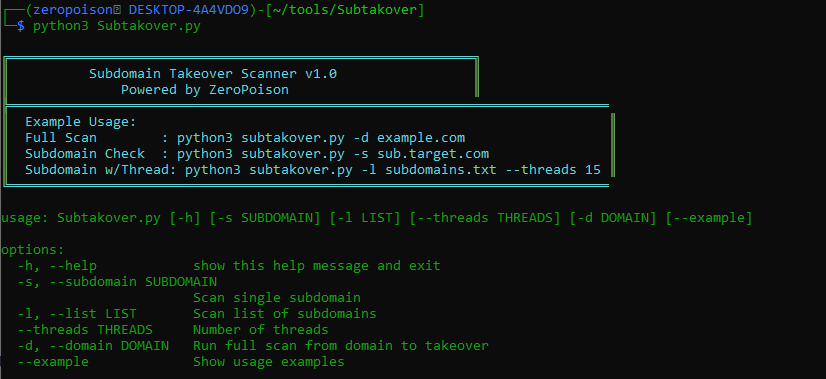

```

## 🔎 Subtakover

**Subtakover** is a powerful subdomain takeover detection tool built for bug bounty hunters and security researchers. It automates subdomain enumeration, filters 404 responses, and matches known fingerprints of third-party services that are prone to takeover vulnerabilities.


---


---

## ✨ Features

- 🔍 Fast subdomain enumeration using [subfinder](https://github.com/projectdiscovery/subfinder)
- 🚫 Filters out subdomains with HTTP `404` status
- 🔎 Fingerprint detection for popular vulnerable services (GitHub, AWS, Bitbucket, etc.)
- 🧵 Multi-threaded scanning for large wordlists
- 📝 Outputs formatted reports with status, CNAME, ASN, and Registrar info

---

## 🛠️ Installation

Make sure you have the following tools installed:

```bash
go install -v github.com/projectdiscovery/subfinder/v2/cmd/subfinder@latest
go install -v github.com/projectdiscovery/httpx/cmd/httpx@latest
pip install -r requirements.txt
````

Required Python modules:

```bash
pip install ipwhois dnspython python-whois requests
```

---

## ⚙️ Usage

### Full Domain Scan

```bash
python3 Subtakover.py -d example.com
```

### Scan Single Subdomain

```bash
python3 Subtakover.py -s blog.example.com
```

### Scan Subdomain List (with Threads)

```bash
python3 Subtakover.py -l subdomains.txt --threads 15
```

---

## 📁 Output Files

| File                  | Description                         |
| --------------------- | ----------------------------------- |
| `subs_temp.txt`       | Raw subdomains from Subfinder       |
| `404_subdomains.txt`  | Subdomains returning HTTP 404       |
| `takeover_report.txt` | Final report with takeover analysis |

---

## 📸 Demo



---

## 📄 License

This project is licensed under the [MIT License](LICENSE).

---

## ⚠️ Disclaimer

This tool is created for **educational and authorized testing** purposes only.
**Do not use it on targets you do not own or have explicit permission to test.**

---

## 🤝 Contributing

Pull requests are welcome.
For major changes, open an issue first to discuss what you’d like to change or improve.

---

## 👤 Author

**iamzeropoison**
GitHub: [@iamzeropoison](https://github.com/iamzeropoison)

```
